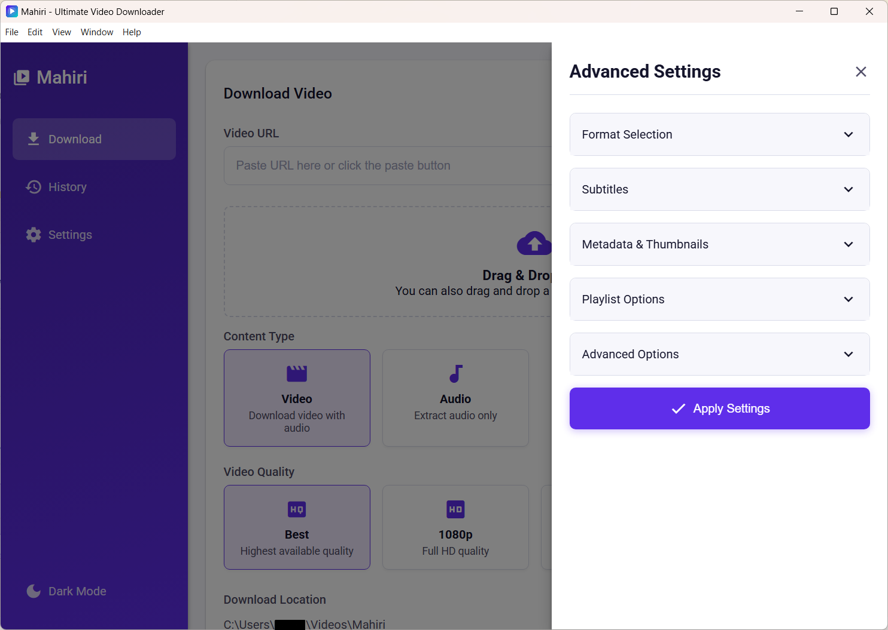
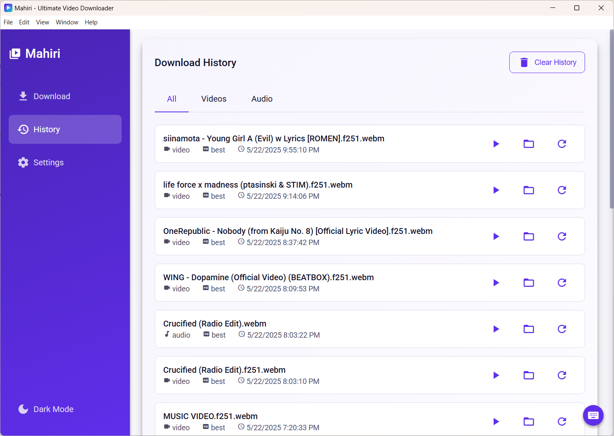
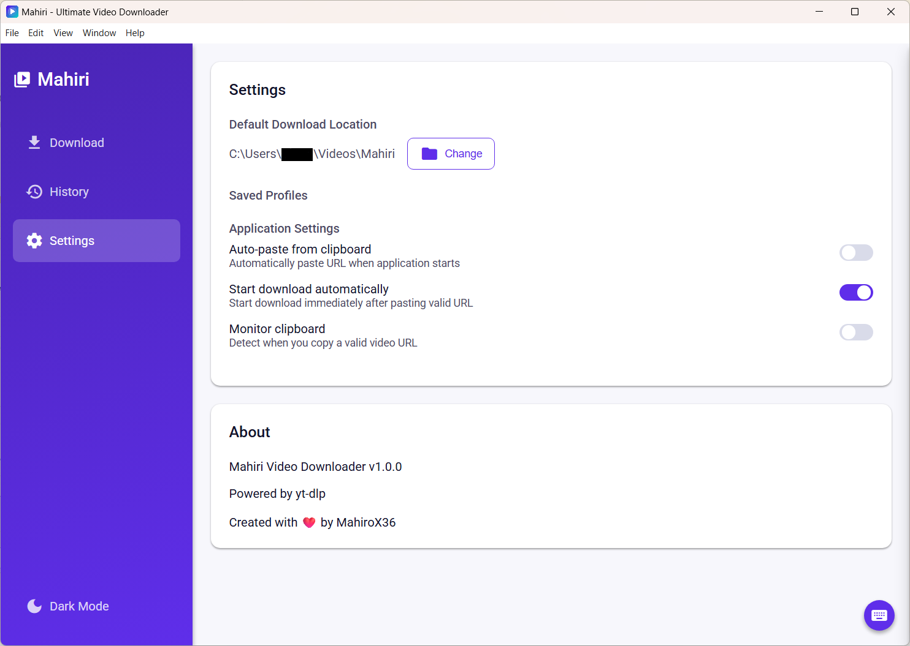
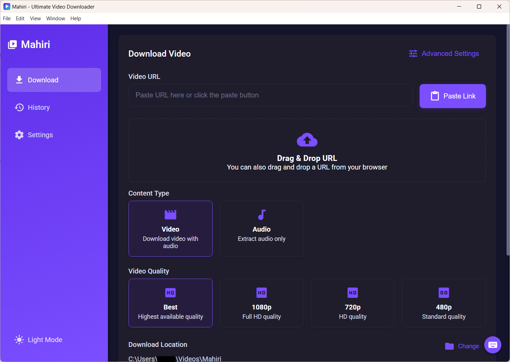

# 🌸 Mihari — Your Adorable Video & Audio Downloader 💖

Mihari is a sleek, fast, and _super customizable_ media downloader powered by [yt-dlp](https://github.com/yt-dlp/yt-dlp)!  
Whether you're saving a single song or downloading an entire playlist, Mihari makes it easy, efficient, and cute. ✨
👉 **[Download Mihari for Windows](https://github.com/mahirox36/Mihari/releases/latest)**, Just grab the `Mihari-Setup.exe` and you're good to go!

---

## ✨ Features

- 🎬 **Download Any Video** — Powered by `yt-dlp`, download from thousands of sites.
- ♾️ **Unlimited Downloads** — Download as much as you want, as often as you want. No limits, no restrictions!
- ⚙️ **Fully Customizable** — Choose format, quality, subtitles, metadata, thumbnails, cookies, and more!
- 🖱️ **One-Click or Shortcut Downloading** — Fast and easy, the way it should be.
- 📦 **Batch Downloads** — Paste multiple links and download them all in one go!
- 📋 **Smart Clipboard Detection** — Auto-pastes URL from clipboard on launch + detects new copied URLs!
- 🕘 **Download History** — See what you’ve downloaded at a glance.
- 🎧 **Supports Tons of Formats** — MP4, MP3, M4A, WebM, FLAC, and more!
- 🌚 **Dark Mode Support** — For late-night downloading sessions.
- 📁 **Custom Download Folder** — Save media wherever _you_ want.
- ⚡ **Keyboard Shortcuts** — Fly through downloads like a pro.

---

## 🚀 Large Core Changes Incoming!

Mihari is evolving from a simple HTML + JS app into a full-fledged system powered by **React + TypeScript** on the frontend, bringing you a smoother and more modern experience! 💻✨

- 🌟 **Frontend Overhaul:** The desktop app will be rebuilt using React + TypeScript for better performance and maintainability.
- 📱 **New Platforms:** An Android version and a website version are in development, so Mihari can be with you everywhere.
- 🛠️ **Backend Server:** A dedicated backend will handle all the heavy lifting for the website and Android apps.
- 🖥️ **Desktop Independence:** The desktop version will stay fully local — no server required — ensuring fast, private, and offline-friendly use.

The backend server is almost finished! Next up: wrapping up the desktop app, publishing its release, and then moving on to the Android and web versions. Everything is currently in progress and shaping up nicely! 🌸

---

## 💡 Why Mihari?

Mihari is built for those who want power _and_ personality.  
With its intuitive interface and cute vibes, it’s your perfect companion for downloading anything from anywhere — fast, easy, and full of sparkle. 🌟

---

## 🛠️ Powered By

- [yt-dlp](https://github.com/yt-dlp/yt-dlp) — A feature-rich YouTube downloader
- [Electron](https://www.electronjs.org/) — Making the desktop magic happen ✨ Built with a sprinkle of code, a dash of creativity, and a whole lot of 💖 love 💖

---

## 💖 License

This project is licensed under the MIT License.  
Use it, modify it, share it — Mihari loves making friends!

---

## 🌟 More Screenshots

A peek into Mihari’s world! 🖼️

### ⚙️ Advanced Settings

Tweak formats, subtitles, metadata, and more~  

### 📜 Download History

Keep track of everything you’ve downloaded!  

### 🛠️ App Settings

Customize your experience to fit your vibe.  

### 🌙 Dark Mode

Because your eyes deserve cozy, too~  

