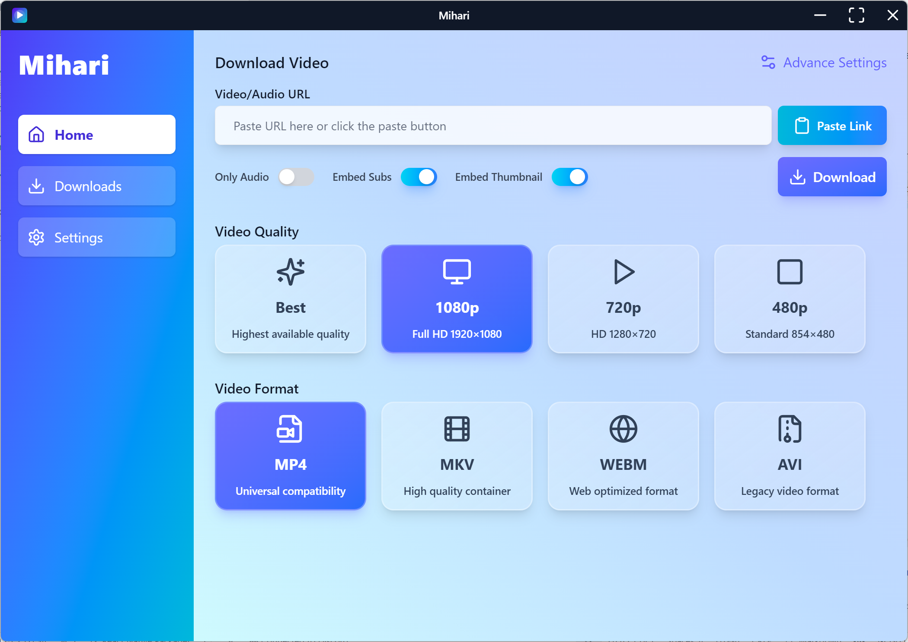
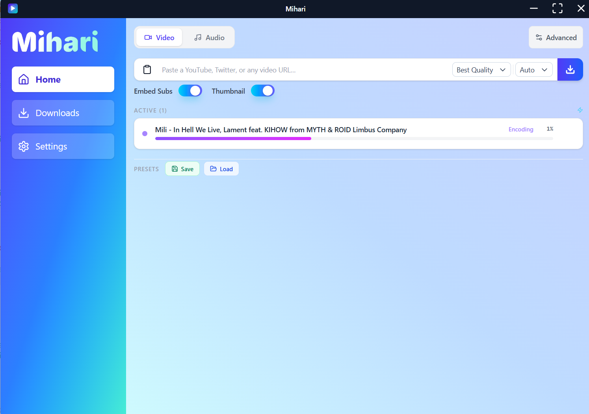

# 🌸 Mihari — Your Adorable Video & Audio Downloader 💖

**Mihari** is a sleek, fast, and _super customizable_ media downloader powered by [yt-dlp](https://github.com/yt-dlp/yt-dlp)!  
Whether you're saving a single song or downloading an entire playlist, **Mihari** makes it easy, efficient, and cute too! ✨
👉 **[Download Mihari for Windows](https://github.com/mahirox36/Mihari/releases/latest)**, Just grab `Mihari-Setup.exe` and you’re ready to go!

> Note: this image is a preview of the next version of the app, if you want to know the [current app look](#-current-app-look) go to the bottom

---

## ✨ Features

- 🎬 **Universal Video Support** — Download from thousands of platforms via `yt-dlp`.
- ♾️ **Unlimited Downloads** — No caps, no restrictions. Download freely!
- ⚙️ **Highly Customizable** — Choose format, quality, subtitles, metadata, thumbnails, cookies, and more!
- 🖱️ **One-Click Simplicity** — Download instantly with a single click or keyboard shortcut.
- 📦 **Batch Downloading** — Drop multiple URLs and let **Mihari** handle the rest.
- 📋 **Clipboard Magic** — Auto-pastes links on launch.
- 🕘 **Download History** — Instantly see what you’ve downloaded before.
- 🎧 **Wide Format Support** — From MP4 to MP3, WebM to FLAC — **Mihari** handles them all.
- 🌙 **Dark Mode** — For cozy late-night downloads.
- 📁 **Custom Save Locations** — Save files exactly where you want them.
- ⚡ **Power Shortcuts** — Navigate faster than ever with built-in hotkeys.

---

## 🚧 Large Core Changes Incoming!

**Mihari** is evolving from a simple HTML + JS app into a full-fledged system powered by **React + TypeScript** on the frontend, bringing you a smoother and more modern experience! 💻✨

- 🌟 **Frontend Overhaul:** The desktop app will be rebuilt using React + TypeScript for better performance and maintainability.
- 📱 **New Platforms:** An Android version and a website version are in development, so **Mihari** can be with you everywhere.
- 🛠️ **Backend Server:** A dedicated backend will handle all the heavy lifting for the website and Android apps.
- 🖥️ **Desktop Independence:** The desktop version will stay fully local — no server required — ensuring fast, private, and offline-friendly use.

> The backend is essentially complete (99% done)! I’m now fully focused on finalizing the desktop app. Once it’s polished and released, the Android and web versions will come next~ 🌸

---

## 💡 Why Mihari?

**Mihari** is built for those who want power _and_ personality.  
With its intuitive interface and cute vibes, it’s your perfect companion for downloading anything from anywhere — fast, easy, and full of sparkle. 🌟

---

## 🛠️ Powered By

- [yt-dlp](https://github.com/yt-dlp/yt-dlp) — A feature-rich YouTube downloader
- [Electron](https://www.electronjs.org/) — A framework for cross-platform desktop apps

---

## 💖 License

This project is licensed under the MIT License.  
Use it, modify it, share it — **Mihari** loves making friends!

## 🌟 Current app look

