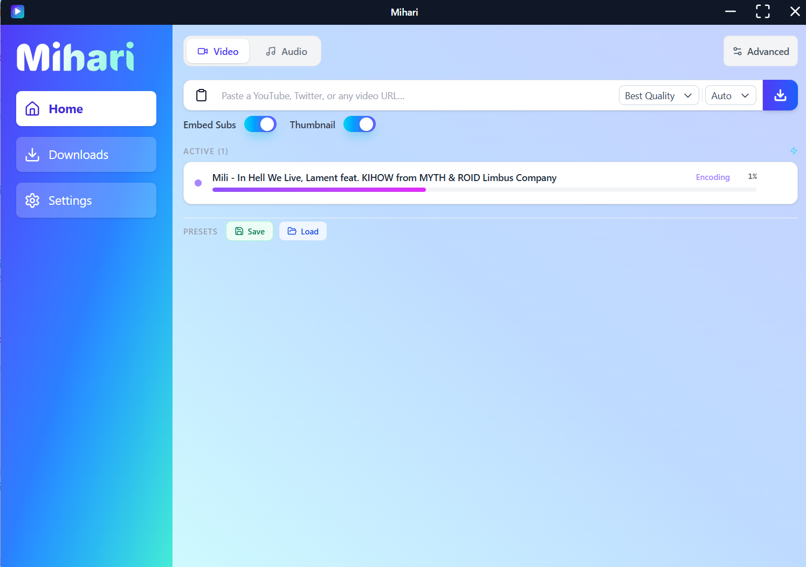

# 🌸 Mihari — Your Adorable Video & Audio Downloader 💖

**Mihari** is a sleek, fast, and _super customizable_ media downloader powered by [AsyncYT](https://github.com/mahirox36/asyncyt)!  
Whether you're saving a single song or downloading an entire playlist, **Mihari** makes it easy, efficient, and cute too! ✨
👉 **[Download Mihari-BETA for Windows](https://github.com/mahirox36/Mihari/releases/latest)**, Just grab `Mihari-Setup.exe` and you’re ready to go!

> Mac and Linux will release in the final build and not in the pre-release!

---

## ✨ Features

- 🎬 **Universal Video Support** — Download from thousands of platforms via `AsyncYT`.
- ♾️ **Unlimited Downloads** — No caps, no restrictions. Download freely!
- ⚙️ **Highly Customizable** — Choose format, quality, subtitles, metadata, thumbnails, cookies, and more!
- 🖱️ **One‑Click Simplicity** — Download instantly with a single click or keyboard shortcut. _(Shortcuts coming soon!)_
- 📥 **Multiple Links at Once** — Paste in several links together and **Mihari** will download them all simultaneously.
- 📋 **Clipboard Magic** — Auto‑pastes links on launch.
- 🕘 **Download History** — Instantly see what you’ve downloaded before.
- 🎧 **Wide Format Support** — From MP4 to MP3, WebM to FLAC — **Mihari** handles them all.
- 🌙 **Theme Support** — Light mode for sunny days, dark mode for cozy late nights.
- 🏗️ **Frontend Overhaul** — Rebuilt with **React + TypeScript** for a smoother, snappier, and prettier experience. ✨
- 💻 **Cross‑Platform Magic** — Runs beautifully on **Windows, macOS, and Linux** so you can download anywhere!
- 📁 **Custom Save Locations** — Save files exactly where you want them.
- 🔔 **Notifications** — Get an instant alert when your downloads finish.
- ⚡ **Power Shortcuts** — Navigate faster than ever with built‑in hotkeys.
- 📂 **On‑Download Actions** — Auto‑play, open folder, or do nothing. Your choice!
- 🍥 **System Tray** — Access key actions right from your system tray — open your downloads folder or instantly paste & download files!
- 💾 **Custom Presets** — Save, load, export, and import your favorite download settings in a single click. Perfect for switching between setups effortlessly

---

## 💡 Why Mihari?

**Mihari** is built for those who want power _and_ personality.  
With its intuitive interface and cute vibes, it’s your perfect companion for downloading anything from anywhere — fast, easy, and full of sparkle. 🌟

---

## 🛠️ Powered By

- [AsyncYT](https://github.com/mahirox36/asyncyt) — Fully async, high‑performance media downloader powered by yt‑dlp and ffmpeg — works across a wide range of sites.
- [Electron](https://www.electronjs.org/) — A framework for cross-platform desktop apps

---

## 💖 Licenses for Mihari Components

Mihari is a multi-part project with different licenses for each component.  
Here’s a quick overview of the licenses used:

| Component              | Path                                                                    | License |
| ---------------------- | ----------------------------------------------------------------------- | ------- |
| Desktop app (Electron) | [Mihari/desktop](https://github.com/mahirox36/Mihari/tree/main/desktop) | GPLv3   |
| Web frontend           | [Mihari/web](https://github.com/mahirox36/Mihari/tree/main/web)         | AGPLv3  |
| Server backend         | [Mihari/server](https://github.com/mahirox36/Mihari/tree/main/server)   | AGPLv3  |
| AsyncYT                | [Async](https://github.com/mahirox36/AsyncYT)                           | MIT     |

See each component's LICENSE file for full details.
